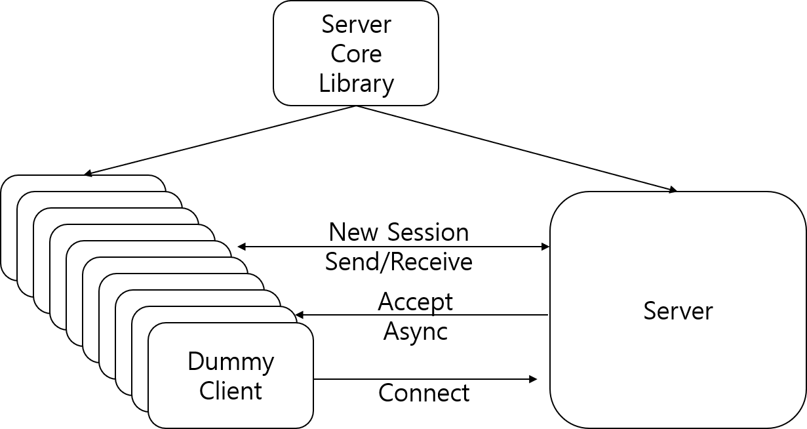
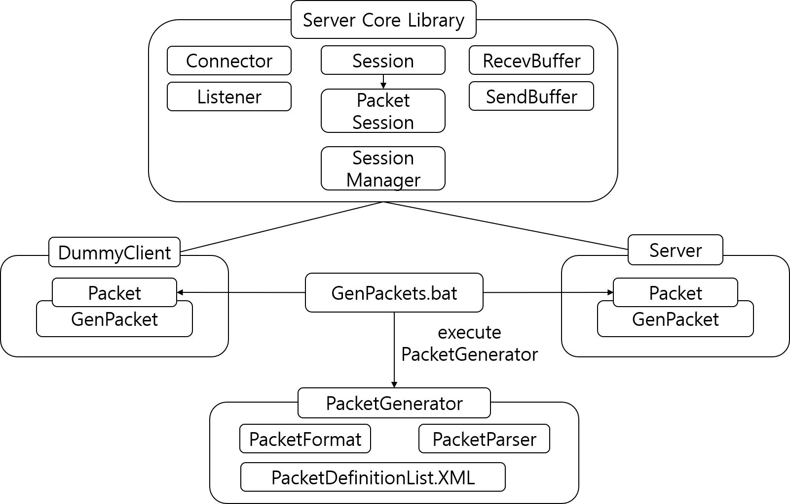
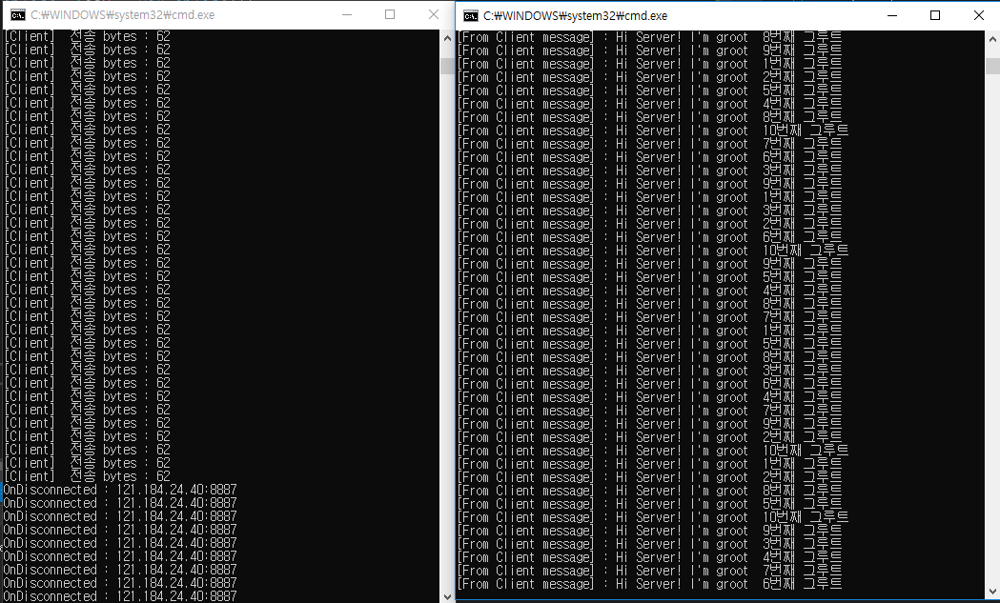

## 비동기 소켓 서버 클라이언트 프로그램

## 시스템 블록도

## 세부 블록도

## 동작모습

10개의 클라이언트가 250ms 단위로 지속적으로
서버에 패킷 데이터를 보내고 서버측에서 받는 그림

### 개발환경
Language : C#
Framework : .Net Framework 4.6
(IDE, ETC) : visual studio 2017
